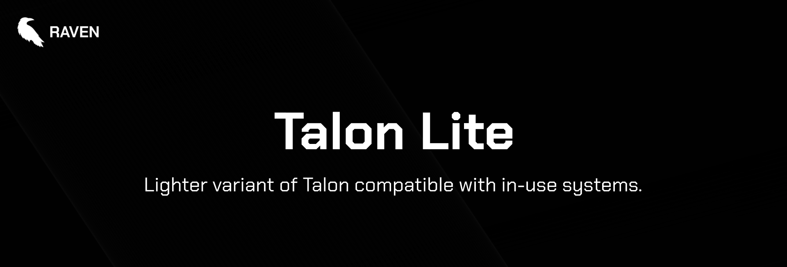

  

> [!NOTE]
> All of our free software is designed to respect your privacy, while being as simple to use as possible. Our free software is licensed under the [BSD-3-Clause license](https://ravendevteam.org/files/BSD-3-Clause.txt). By using our software, you acknowledge and agree to the terms of the license.

Lighter variant of Talon compatible with in-use systems.

> [!CAUTION]
> Talon Lite **is** compatible with Windows 10/11 Home/Professional/Enterprise/Education/LTSC unlike [Talon](https://github.com/ravendevteam/talon), however it does not debloat as much compared to the regular version as a result.

## Installation
You can download the latest version of Talon Lite from [here](https://debloat.win).

To compile from source, make sure you have Python 3.12.4, install the necessary libraries from `requirements.txt`, then run `build.bat`. **Please note that, when building from source, you are building the absolute latest version of the code (even newer than the most recent release)**!

# Documentation
Documentation is in progress and will be made available soon.

## Authors & Contributors

- [Raven Development Team](https://ravendevteam.org/)
- [Icons by Icons8](https://icons8.com/)
- [ChrisTitusTech](https://github.com/christitustech) ([CTT WinUtil](https://github.com/christitustech/winutil))
- [Raphire](https://github.com/Raphire) ([Win11Debloat](https://github.com/Raphire/Win11Debloat))
- [mre31](https://github.com/mre31)
- [DTLegit](https://github.com/DTLegit)
- [zombiehunternr1](https://github.com/zombiehunternr1)
- [lilafian](https://github.com/lilafian)
- [winston113](https://github.com/winston113)
- [GabanKillasta](https://github.com/GabanKillasta)
- [urbanawakening](https://github.com/urbanawakening)
- [Mskitty301](https://github.com/Mskitty301)
- [SuperSonic3459](https://github.com/SuperSonic3459)
- [swordmasterliam](https://github.com/swordmasterliam)
- [Neoskimmer](https://github.com/Neoskimmer)
- [lukkaisito](https://github.com/lukkaisito)
- [alcainoism](https://github.com/alcainoism)
- [JanluOfficial](https://github.com/JanluOfficial)
- [Xirdrak](https://github.com/Xirdrak)
- [Alandlt15](https://github.com/Alandlt15)
- [lotusflowr](https://github.com/lotusflowr)
- [ArcticSnowyFox](https://github.com/ArcticSnowyFox)
- [TNTim1](https://github.com/TNTim1)
- [Thrallfaec](https://github.com/Thrallfaec)